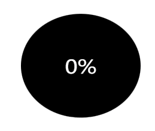
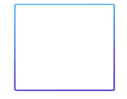

## E-DataV
<a href="https://www.npmjs.com/package/e-datav-react">
    
</a>

### 什么是E-DataV-React?

* E-DataV-React是一个基于**React**的数据可视化组件库（[Vue2版本](https://github.com/costaq/E-DataV)及[Vue3版本](https://github.com/costaq/E-DataV-Vue3)）
* 提供数据可视化大屏所需的各种组件，朋友写的[DataV](https://github.com/DataV-Team/DataV)组件库中已有的组件，我这边不会过多增加，最多是效果提升
* 因个人比较佛系，更新会比较慢，但会持续更新


### npm安装

```shell
$ npm install e-datav-react
```

### 使用

```js

// 按需引入
import { FullScreenContainer, DigitalFlop } from 'e-datav-react';

```

### 组件介绍

#### 数字翻牌器

```js

import { DigitalFlop } from 'e-datav-react';

function Page() {

  return (
    <div>
      <DigitalFlop value={5000} />
    </div>
  )
}

export default Page
```
##### 效果演示


##### 可选参数
字段|类型|备注
-|-|-
value|Number|数值，默认1000
decimals|Number|小数点，默认0
duration|Number|持续时间，默认3000毫秒
fontSize|Number|字体大小，默认50
fontFamily|String|字体，默认液晶字体，传空值则恢复正常浏览器字体
color|String|颜色，默认#000
separator|String|千位分隔符，默认''


#### 水位图

```js

import { WaterLevelPond } from 'e-datav-react';

function Page() {

  return (
    <div>
      {/* 宽高不设置，按照父元素100%拉伸 */}
      <WaterLevelPond value={56} style={{ width: 150, height: 150 }} />
    </div>
  )
}

export default Page
```
##### 效果演示



##### 可选参数
字段|类型|备注
-|-|-
value|Number|数值，必填
decimals|Number|小数点，默认0
duration|Number|数字变动时动画持续时间，默认3000毫秒
fontSize|Number|字体大小，默认36
fontColor|String|颜色，默认#000
backgroundColor|String|背景色颜色，默认transparent透明
waveColors|String[]|水波颜色，默认['#41a9e3', '#b0e0ff']，第一个参数为前波浪，后一个参数为后波浪


#### Tab组件

```js

import { Tab } from 'e-datav-react';

function Page() {
  const items = [
    {
      label: '测试1',
      value: '123'
    },
    {
      label: '测试2',
      value: '1234'
    },
    {
      label: '测试3',
      value: '1235'
    }
  ]

  const handleChange = (value) => {
    console.log(value);
  }

  return (
    <div>
      {/* 宽高不设置，按照父元素100%拉伸 */}
      <Tab items={items} onChange={handleChange} columns={3}></Tab>
    </div>
  )
}

export default Page
```

##### 效果演示

竖列效果


横列效果


##### 可选参数
字段|类型|备注
-|-|-
value|Number或String|非必填，必须是数字或字符串，指定当前值，若不指定，则会默认选中items中的第一个
items|TabItem[]|项，必填
columns|Number|列数，非必填，默认值3，表示显示3列，单竖列效果即传值1即可
margin|Number|间距，非必填，默认每项间距10px
fontSize|Number|文本字号，非必填，默认16
fontColor|Number|文本颜色，非必填，默认#fff
backgroundColor|Number|背景色，非必填，默认transparent
duration|Number|动画持续时间，非必填，默认值3，表示3秒
borderColors|Number|边框渐变颜色，非必填，默认值['#1CE3B6', '#1F38F1', '#F95A5A']

###### TabItem
字段|类型|备注
-|-|-
label|String|显示名
value|Number或String|值，必须是数字或字符串

###### 事件
事件名称|说明|回调参数
-|-|-
onChange|值变化时触发的事件|选中的item值


#### 全屏组件

根据屏幕尺寸，自动拉伸

```js

import { FullScreenContainer, DigitalFlop } from 'e-datav-react';

function Page() {

  return (
    <div>
      <FullScreenContainer>
        <DigitalFlop value={5000} />
      </FullScreenContainer>
    </div>
  )
}

export default Page

```

##### 可选参数
字段|类型|备注
-|-|-
type|String|数值，默认'full', 其他可选类型：full（全屏拉伸） full-width（宽度拉伸 ）full-height（高度拉伸）initial （默认不拉伸）
width|Number|大屏设计稿宽度，也就是公司设计师出的效果图尺寸，默认1920
height|Number|大屏设计稿高度，默认1080


#### 边框组件

所有边框组件，根据父容器宽高自适应

边框组件1

```js

import { BorderBox1 } from 'e-datav-react';

function Page() {

  return (
      <div style={{ height: 200, width: 200 }}>
          <BorderBox1>
          </BorderBox1>
      </div>
  )
}

export default Page

```

##### 效果演示



##### 可选参数
字段|类型|备注
-|-|-
borderRadius|Number|边框圆角，默认值3
borderWidth|Number|边框宽度，默认值3
colors|String[]|渐变颜色，默认值['#5ddcff', '#4e00c2']，只接受2个值
duration|Number|动画持续时间，默认值4，单位秒